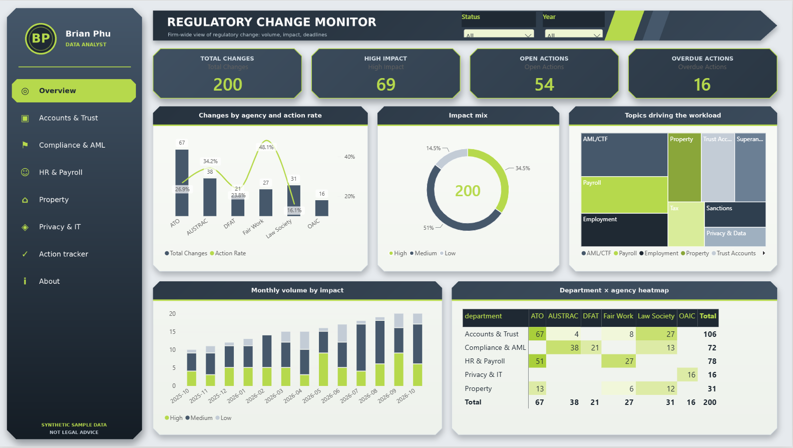

# Regulatory Change Monitor

A Power BI report (plus an interactive HTML design preview) that tracks regulatory changes from Australian agencies (AUSTRAC, ATO, Fair Work, Law Society, OAIC, DFAT) and maps them to the departments of a law firm: which changes matter, how urgent they are, and what still needs action.

> **All data is synthetic.** The ~200 items are invented for demonstration and are not real agency announcements. Tags (topic, impact, audience, action required, deadline) come from transparent keyword rules in `classifier.py`, not from a model, and this is not legal advice. There is no web scraping in this project.



*Overview page of the Power BI report (`powerbi/regulatory_change_monitor.pbix`): 200 synthetic changes, 69 high impact, 54 open actions, 16 overdue. An interactive HTML design preview is in `preview/dashboard_preview.html`.*

**Who it is for:** a compliance lead or practice manager who wants to see at a glance which regulatory changes matter, how urgent they are and who has to act, without reading every agency bulletin. A "Key takeaways" line on the overview states the three things to know in plain English.

## At a glance

[](https://github.com/brianphu2310/Regulartory_Change_Monitor/actions)

| | |
|---|---|
| **Question** | Which regulatory changes matter to a law firm, how urgent are they, and who has to act? |
| **What I built** | Rule-based classifier (topic, impact, audience, action, deadline), star-schema CSVs and a Power BI report with drill-through pages. |
| **Key results** | 200 synthetic changes across 6 agencies: 69 high impact, 54 open actions, 16 overdue. |
| **Proof** | CI green, 9 tests; CI regenerates the dataset on every push. |
| **Honest limits** | All data is synthetic and there is no scraping, by design. Tags come from transparent keyword rules, not a model. Not legal advice. |

## What is in the repo
| Path | What it is |
|---|---|
| `powerbi/regulatory_change_monitor.pbix` | The Power BI report (open in Power BI Desktop) |
| `preview/dashboard_preview.html` | Interactive HTML design preview (d3), opens in any browser |
| `bi_export/` | Star-schema CSV tables the report is built on |
| `generate_synthetic.py` | Builds the synthetic dataset (seeded, reproducible shape) |
| `classifier.py` | Rule-based tagging: topic, impact, audience, action required, deadline |
| `db.py`, `export_for_bi.py` | SQLite storage and CSV export for BI tools |
| `app.py` | Small Streamlit explorer over the same data |
| `POWERBI_GUIDE.md`, `TABLEAU_GUIDE.md` | Model, DAX measures and build notes |

## Power BI report
8 visible pages: Overview, five department pages (Accounts & Trust, Compliance & AML, HR & Payroll, Privacy & IT, Property), Action tracker and About. Four hidden pages support interactivity:
- **Change detail** and **Topic detail**: drill-through pages. Right-click an agency (or a topic) and choose *Drill through*; a Back button is included.
- **Agency tooltip** and **Topic tooltip**: report-page tooltips shown on hover.

Header dropdowns (Status, Year) are synced across pages; every chart cross-filters the others; the Action tracker colours deadlines by urgency.

Model: `changes` fact table with `dim_date`, `dim_department`, `dim_topic` and bridge tables (`change_topics`, `change_audiences`, `topic_department`). Measures include Total Changes, High Impact, Open Actions, Overdue Actions, Due In 30 Days and Action Rate.

Things to know: Power BI has no true 3D charts, so panel shapes are background images. In Power BI Desktop, sidebar navigation needs Ctrl+click; a single click works once published. Agency names are text, not official logos.

## Tests and CI
`python -m pytest -q` runs 9 tests: classifier rules (topics, impact, audiences, action required, deadline extraction), plus consistency checks on the committed star-schema CSVs (unique ids, every bridge row points at a real change, everything labelled `Sample`). CI also regenerates the synthetic data on every push. Field meanings are in [`docs/DATA_DICTIONARY.md`](docs/DATA_DICTIONARY.md); skills map in [`docs/SKILLS_DEMONSTRATED.md`](docs/SKILLS_DEMONSTRATED.md).

## Run the Python side
```bash
pip install -r requirements.txt
python export_for_bi.py --sample   # generate synthetic data and write bi_export/ CSVs
streamlit run app.py               # optional explorer
```
Note: dates are generated relative to today, so re-running shifts them slightly compared with the CSVs committed here.

## Design choices
- Rule-based tagging so every label is explainable and auditable.
- Star schema with separate bridge tables for the many-to-many topic and audience tags.
- Deadline and heat colours are DAX measures, so the report stays dynamic.
